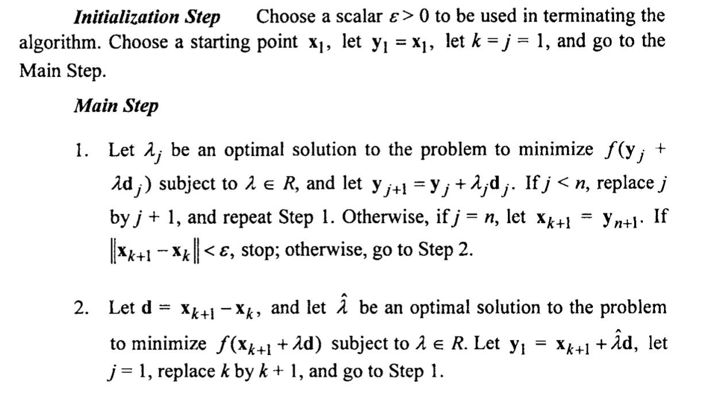

# hooke-and-jeeves-method
MATLAB implementation of Hooke and Jeeves method - a multidimensional search algorithm without using derivatives.

#### Summary of method of Hooke and Jeeves using Line Searches

